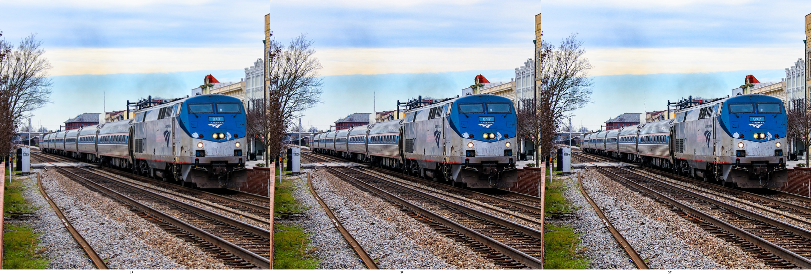
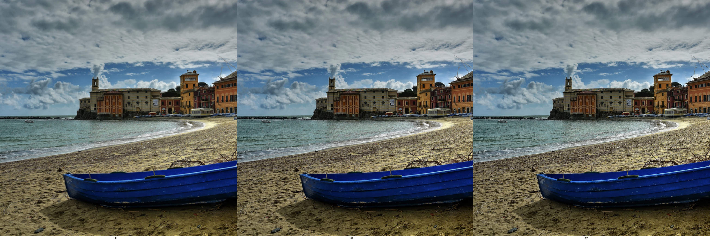
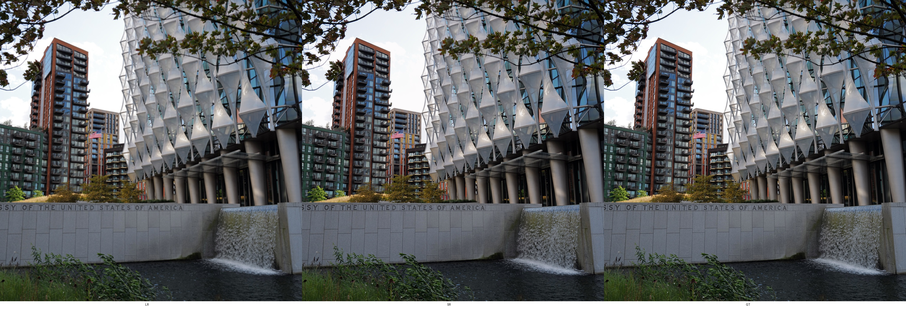
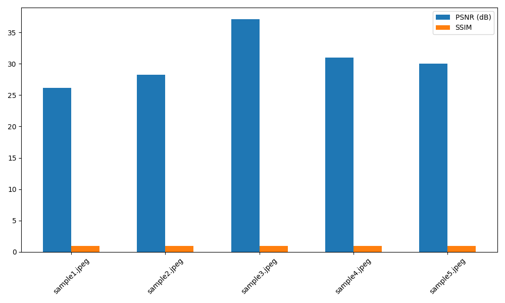

# SRCNN Evaluation Report

## Metrics

| Image | PSNR (dB) | SSIM | Compare |
|---|---:|---:|---|
| sample1.jpeg | 26.1386 | 0.9870 |  |
| sample2.jpeg | 28.2685 | 0.9818 |  |
| sample3.jpeg | 37.0966 | 0.9974 |  |
| sample4.jpeg | 31.0066 | 0.9939 |  |
| sample5.jpeg | 30.0388 | 0.9905 |  |

## Summary

* Average PSNR: 30.5098 dB
* Average SSIM: 0.9901

