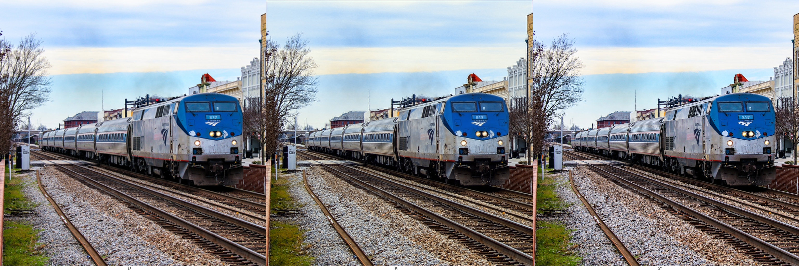
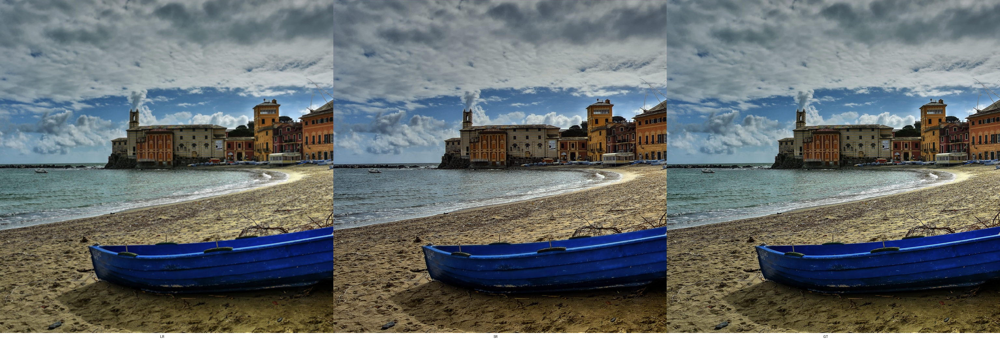
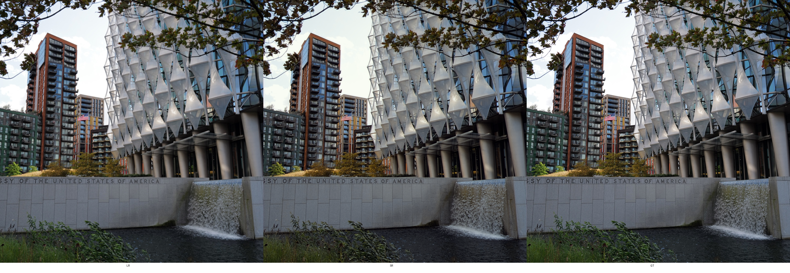
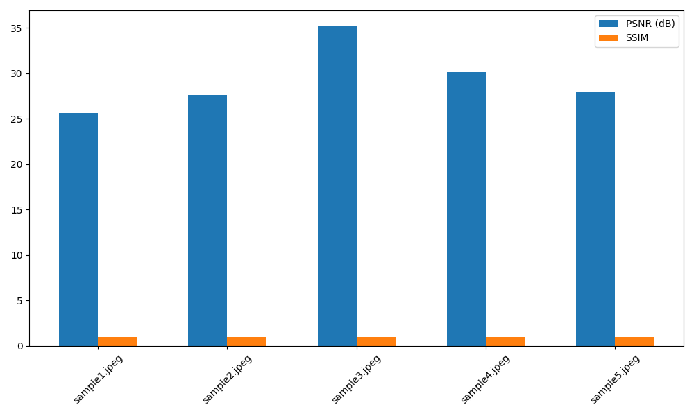

# SRCNN Evaluation Report

## Metrics

| Image | PSNR (dB) | SSIM | Compare |
|---|---:|---:|---|
| sample1.jpeg | 25.6535 | 0.9856 |  |
| sample2.jpeg | 27.5854 | 0.9795 |  |
| sample3.jpeg | 35.1723 | 0.9965 |  |
| sample4.jpeg | 30.1299 | 0.9929 |  |
| sample5.jpeg | 28.0169 | 0.9869 |  |

## Summary

* Average PSNR: 29.3116 dB
* Average SSIM: 0.9883

